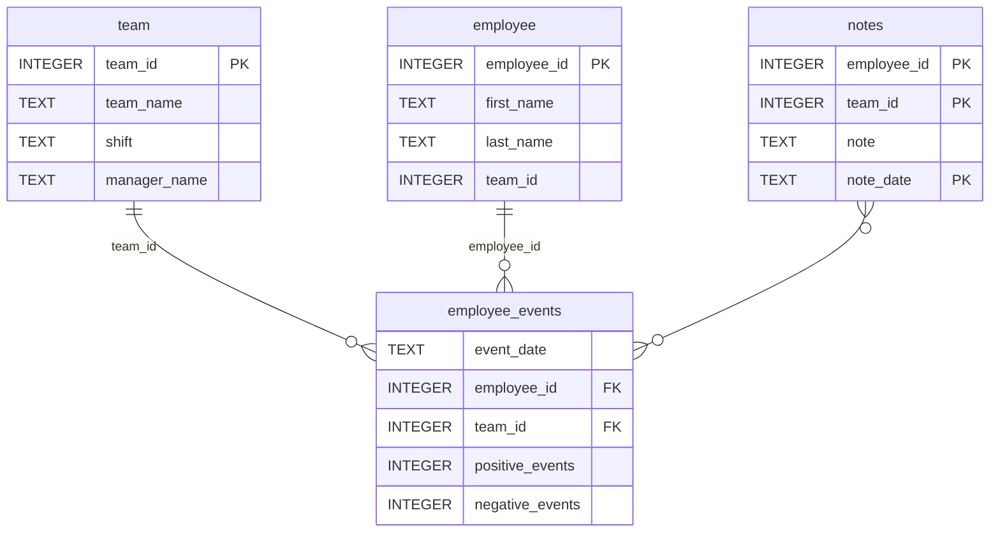

# This is test update by PCB 15-Aug
# Software Engineering for Data Scientists 

##### Install instructions

# Step 1: Clone this repo to your local environment 
```
git clone <git repo full url>
```
# Step 2: Create Python Virtual Environment
    ```
    python3 -m venv .env
    ```
# Step 3: Activate the virtual environment
    ```
    source .env/bin/activate
    ```
# step 4: Install requirements/dependencies
    ```
    pip3 install -r requirements 
    ```
# step 5: run the webapp 
    ```
    python3 report/dashboard.py
    ```
    Alternatively, one of the following commands can also be used after complete all the above steps:
    ```
    ./start
    ```
    ```
    sh start
    ```
### App will run in the local host at port 5001


This repository contains the code for the "Data Scientist dashboard" project for Nano Degree Course from Udacity.

### Repository Structure
```
├── README.md (this file)
├── assets
│   ├── model.pkl
│   └── report.css
├── env
├── python-package
│   ├── employee_events
│   │   ├── __init__.py
│   │   ├── employee.py
│   │   ├── employee_events.db
│   │   ├── query_base.py
│   │   ├── sql_execution.py
│   │   └── team.py
│   ├── requirements.txt
│   ├── setup.py
├── report
│   ├── base_components
│   │   ├── __init__.py
│   │   ├── base_component.py
│   │   ├── data_table.py
│   │   ├── dropdown.py
│   │   ├── matplotlib_viz.py
│   │   └── radio.py
│   ├── combined_components
│   │   ├── __init__.py
│   │   ├── combined_component.py
│   │   └── form_group.py
│   ├── dashboard.py
│   └── utils.py
├── requirements.txt
├── start
├── tests
    └── test_employee_events.py
```

### employee_events.db


